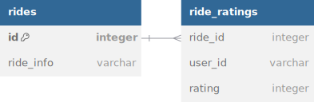
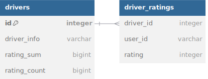

# Efficient number based rating system

In this article I want to describe algorithm that I use when developing rating systems based on numbers/stars (rate from 1 to 10, or give some number of stars). It's pretty obvious that this kind of use cases you can meet all over the services online or even offline (restaurant reviews, driver review, taxi driver feedback, etc.). It's usually a form that you come across after you receive your service or good. 

<p align="center">
 
</p>

For the sake of simplicity, let's use driver rating system, as an example, but keep in mind that this approach can be used for rating anything. I also omitted things like authentication/authorization, pagination, because this article is not about that, and these topics deserve their own separate discussion.

I also omitted self-evident operations with HTTP requests processing and JSON serialization/deserialization, that are provided out-of-box in every web framework or standard library of some programming languages. 

I will be using **Go** in this article.

## Requirements

Let's define minimal requirements, we need: 

1. Endpoint that will handle rating of the driver itself 
2. Endpoint that will return list of drivers with their average rating
3. Endpoint that will return list of ratings of the specific driver 

## API Specification

### Driver rating processing
Handles rating of the driver, receive rating data and saves into database.

Request: 
```
POST /drivers/{driver_id}/ratings
{
    "user_id": "{user_id}",
    "rating": {rating:1-5}
}
```

Response: 
```
200 OK
```

### Return list of drivers with their average rating
Returns list of drivers with their average rating (most likely might be used in administration panels for monitoring purposes or analytics)

Request:
```
GET /drivers
```

Response:
```json
[
  {
    "driver_id": "{driver_id}",
    "user_id": "{user_id}",
    "avg_rating": 4.4
  }
]
```

### Return list of ratings of the specific driver
Request:
```
GET /drivers/{driver_id}
```

Response:
```json
[
  {
    "user_id": "{user_id_1}",
    "rating": 4
  },
  {
    "user_id": "{user_id_2}",
    "rating": 5
  }
]
```

## Naive implementation

Let's first discuss how one might implement this feature naively. 

### Database structure

So it's pretty obvious that you need two tables (btw, I will be using relation database with tables, however, this approach can be implemented in any database that supports very simple aggregation functions) and database scheme might look like this (give or take): 



I intentionally omitted data that is not related to rating feature (driver duration, title, etc.) and abstracted it away inside `driver_info` column :)

### Straightforward approach

1. Submitting rating on API level is pretty straightforward just create row in `driver_ratings` table on create rating request. 

    ```sql
    INSERT INTO driver_ratings (driver_id, user_id, rating) 
    VALUES (:driver_id, :user_id, :rating)
    ```
   or if user wants to change the ratings of the driver, that he had rated in the past, then update table: 
   ```sql
   UPDATE driver_ratings SET rating = :new_rating 
   WHERE driver_id = :driver_id AND user_id = :user_id
   ```
   Either way complexity of this operation is `O(1)`

2. When asked to return list of drivers with average rating we run following SQL query: 

    ```sql
    SELECT r.id, AVG(rr.rating) AS avg_rating 
    FROM drivers r 
    LEFT JOIN driver_ratings rr ON r.id = rr.driver_id
    GROUP BY r.id;
    ```

    This is the most interesting part of the feature, let's make a quick analysis on runtime of this query, it's easy to state that it is at least `O(N*M)` where `N` is the number of drivers and `M` is the number of ratings, and that is without considering operations required to actually calculate average rating.

3. Returning list of ratings of specific driver is something that don't need any optimization (at least in context of current article):

    ```sql
   SELECT driver_id, user_id, rating 
   FROM driver_ratings WHERE driver_id = :driver_id;
    ```

You can find full implementation [here](https://github.com/djumanoff/articles/tree/main/efficient-rating-system/naive-impl). 

## Efficient implementation

Implementation with few optimizations. 

### Database structure

Structure of the database remains the same except we add few new columns in `drivers` table. 



There are 2 new columns: `rating_sum`, `rating_count`. So the name of the columns pretty much says what these columns will be storing. 

`rating_sum` will store sum of all the ratings of the given driver, and `rating_count` will store the number of the ratings of the given driver. Given that introduction you might already take a guess that using these two columns it's pretty easy to calculate average rating of the driver, and you will be absolutely right! 

However, there are few questions that need to be addressed: 
1. What happens if user changes his rating? 
2. What to do if the rating needs to be deleted?
3. Why don't we just calculate average rating on every rating request and just store it instead of storing sum and count?

### Endpoints' logic

1. Submitting rating request still creates/updates record in `driver_ratings` table, but now it also does: 
   1. in case of new rating increments `rating_count` and adds rating value into `rating_sum` 
      ```sql
      UPDATE drivers 
      SET rating_sum = rating_sum + :rating, 
        rating_count = rating_count + 1 
      WHERE id = :driver_id
      ```
   2. in case of changing existing rating we need to first subtract old rating from new rating and add result into `rating_sum` and don't anything with `rating_count` since number of ratings were not changed. 
      ```sql
      UPDATE drivers 
      SET rating_sum = rating_sum + :rating - (
        SELECT rating 
        FROM driver_ratings 
        WHERE user_id = :user_id AND driver_id = :driver_id
      )
      WHERE id = :driver_id
      ```
      if this seems counterintuitive, let's consider following example: sum of ratings of the driver was `40` and old rating was `4` and new rating is `5`, so operation above will calculate new sum: `40 + 5 - 4 = 41` which is correct new sum, so after some time user decided to change his rating again from `5` to `2`, let's see what happens: `41 + 2 - 5 = 38` which is correct new sum again. In case of rating deletion, we need to subtract rating value from `rating_sum` and decrement `rating_count` by 1 before deleting record from `driver_ratings`. 
      ```sql
      UPDATE drivers 
      SET rating_sum = rating_sum - (
          SELECT rating 
          FROM driver_ratings 
          WHERE user_id = :user_id AND driver_id = :driver_id
        ),
        rating_count = rating_count - 1
      WHERE id = :driver_id
      ```
      As you can see addition of these operations in submit rating logic won't affect complexity, and it still remains constant `O(1)`.     
2. Using this approach returning list of drivers with their average rating becomes pretty efficient: 
   ```sql
   SELECT r.id, r.rating_sum/r.rating_count AS avg_rating, r.driver_info 
   FROM drivers r
   ```
   This approach will give us complexity of `O(N)` where `N` is the number of drivers. 
3. Returning list of ratings of specific driver remains same as in naive implementation. 

Why don't we just calculate average rating on every rating request and just store it instead of storing sum and count?

Because calculating average rating for specific driver will make rating operation complexity `O(M)` where `M` is the number of ratings of the driver. 

You can find full implementation [here](https://github.com/djumanoff/articles/tree/main/efficient-rating-system/efficient-impl).

This implementation can also be easily reimagined in distributed context, where you have separate `driver` service and `rating` service and `event bus`, you just listen for rating event in driver service and make that simple aggregations. 

PS. I hope this article will be useful for some the developers out there, despite of its simplicity, I was struggling to find this approach in internet and in projects that contained similar functionality.
